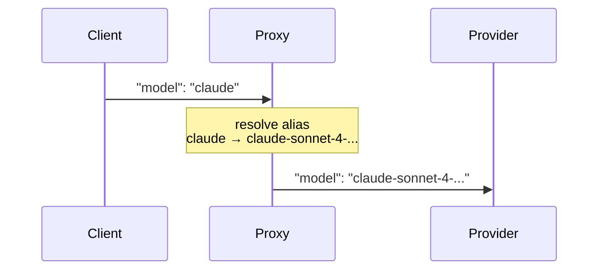

# Model Aliases

## Overview

Model aliases allow you to define short, convenient names that map to real model identifiers. Clients send requests using the alias, and the proxy transparently resolves it to the actual model name before routing.

This is useful when:

- You want to abstract away specific model versions (`claude` -> `claude-sonnet-4-20250514`)
- You need to switch the underlying model without updating all clients
- You want to provide simpler names for frequently used models

## Configuration

Add the `model_alias` section to your `config.yaml`:

```yaml
model_alias:
  gpt-4: gpt-4o
  claude: claude-sonnet-4-20250514
  gemini: gemini-2.5-flash
  fast: gemini-2.5-flash
  smart: claude-sonnet-4-20250514
```

Keys are alias names, values are real model identifiers. Values support environment variable resolution:

```yaml
model_alias:
  default-model: os.environ/DEFAULT_MODEL_NAME
```

## How It Works

1. Client sends a request with `"model": "claude"`
2. Proxy resolves the alias: `claude` -> `claude-sonnet-4-20250514`
3. The `"model"` field in the request body is replaced with the real name
4. Credential selection uses the real model name
5. The upstream provider receives `"model": "claude-sonnet-4-20250514"`



## Behavior

- **Non-alias models pass through unchanged.** A request with `"model": "gpt-4o"` (a real model, not an alias) is not modified.
- **Aliases are not shown in `/v1/models`.** The model list endpoint returns only real models.
- **Self-referencing aliases are ignored.** An alias like `gpt-4: gpt-4` is skipped with a warning in logs.
- **Alias resolution is logged** at DEBUG level: `Resolved model alias alias=claude resolved=claude-sonnet-4-20250514`

## Example: Zero-Downtime Model Upgrade

Switch all clients from GPT-4 to GPT-4o without any client-side changes:

```yaml
# Before: clients use "gpt-4", routed to gpt-4
model_alias:
  gpt-4: gpt-4

# After: clients still use "gpt-4", now routed to gpt-4o
model_alias:
  gpt-4: gpt-4o
```

Restart the proxy to apply the new config — all existing clients automatically use the new model.
