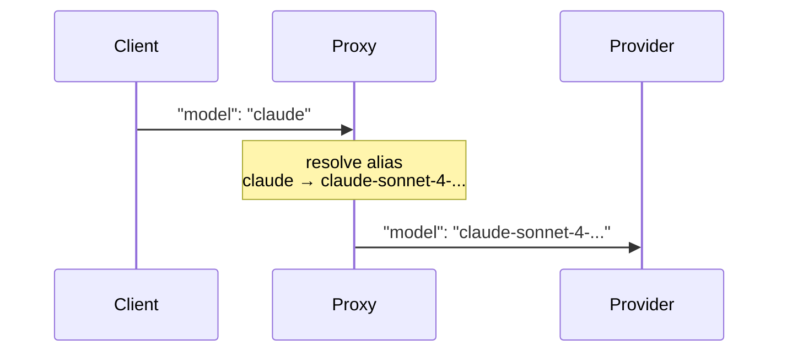
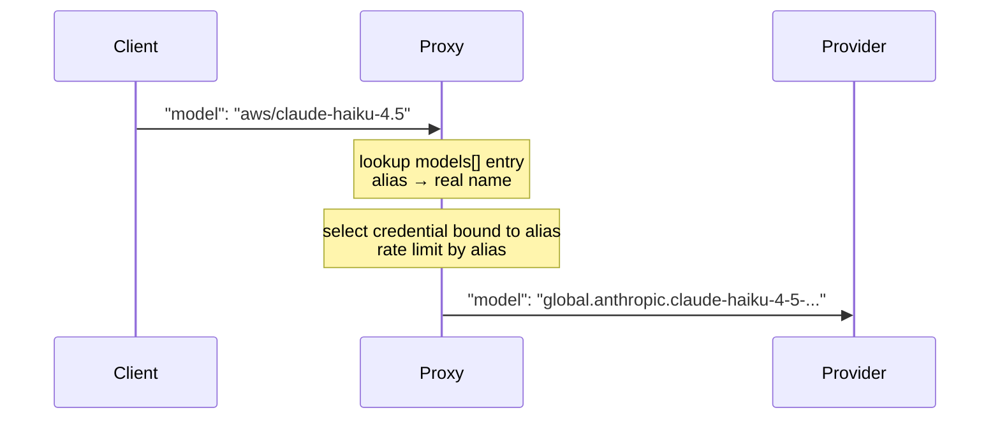

# Model Aliases and Model Name Mapping

There are two independent mechanisms for mapping model names in Auto AI Router. Choose the right one depending on your use case.

|                               | `model_alias`                | `models[].model`                               |
| ----------------------------- | ---------------------------- | ---------------------------------------------- |
| Config section                | Top-level `model_alias:` map | Per-entry `model:` field inside `models:`      |
| Alias visible in `/v1/models` | No                           | Yes                                            |
| Credential bound to alias     | No (binds to real name)      | Yes (binds to alias)                           |
| Rate limiting                 | By real name                 | By alias                                       |
| Use case                      | Short name for any model     | Provider-specific internal name per credential |

______________________________________________________________________

## `model_alias` — Global Aliases

### Overview

`model_alias` lets you define short, convenient names that map to real model identifiers. Clients send requests using the alias; the proxy transparently resolves it to the actual model name before routing.

Useful when:

- You want to abstract away specific model versions (`claude` → `claude-sonnet-4-20250514`)
- You need to switch the underlying model without updating all clients
- You want to provide simpler names for frequently used models

### Configuration

Add the `model_alias` section to your `config.yaml`:

```yaml
model_alias:
  gpt-4: gpt-4o
  claude: claude-sonnet-4-20250514
  gemini: gemini-2.5-flash
  fast: gemini-2.5-flash
  smart: claude-sonnet-4-20250514
```

Keys are alias names, values are real model identifiers. Values support environment variable resolution:

```yaml
model_alias:
  default-model: os.environ/DEFAULT_MODEL_NAME
```

### How It Works

1. Client sends a request with `"model": "claude"`
2. Proxy resolves the alias: `claude` → `claude-sonnet-4-20250514`
3. The `"model"` field in the request body is replaced with the real name
4. Credential selection uses the **real model name**
5. The upstream provider receives `"model": "claude-sonnet-4-20250514"`


```mermaid
sequenceDiagram
    participant Client as Client
    participant Proxy as Proxy
    participant Provider as Provider

    Client->>Proxy: "model": "claude"
    Note over Proxy: resolve alias<br/>claude → claude-sonnet-4-...
    Proxy->>Provider: "model": "claude-sonnet-4-..."
```

### Behavior

- **Non-alias models pass through unchanged.** A request with `"model": "gpt-4o"` (not an alias) is not modified.
- **Aliases are not shown in `/v1/models`.** The model list returns only real model names.
- **Self-referencing aliases are ignored.** An alias like `gpt-4: gpt-4` is skipped with a warning.
- **Alias resolution is logged** at DEBUG level: `Resolved model alias alias=claude resolved=claude-sonnet-4-...`

### Example: Zero-Downtime Model Upgrade

Switch all clients from GPT-4 to GPT-4o without any client-side changes:

```yaml
# Before: clients use "gpt-4", routed to gpt-4
model_alias:
  gpt-4: gpt-4

# After: clients still use "gpt-4", now routed to gpt-4o
model_alias:
  gpt-4: gpt-4o
```

Restart the proxy to apply — all existing clients automatically use the new model.

______________________________________________________________________

## `models[].model` — Per-Credential Real Name

### Overview

The `model` field inside a `models:` entry lets you bind a credential to a model using the **alias name the client sees**, while sending a **different real name to the provider**. This is required when a provider assigns non-standard internal model identifiers (e.g. AWS Bedrock, Azure, enterprise Vertex deployments).

Useful when:

- The provider uses a long internal model ID different from the public name
- You want the alias (e.g. `aws/claude-haiku-4.5`) to be the name clients use and see in `/v1/models`
- You need the credential and rate limits to be bound to the alias, not the internal name

### Configuration

```yaml
credentials:
  - name: "aws-bedrock"
    type: "bedrock"
    api_key: "os.environ/AWS_BEDROCK_KEY"
    base_url: "https://bedrock-runtime.us-east-1.amazonaws.com"
    rpm: -1
    tpm: -1

models:
  - name: aws/claude-haiku-4.5               # alias — shown to clients, used for routing
    model: global.anthropic.claude-haiku-4-5-20251001-v1:0  # real name — sent to provider
    credential: aws-bedrock
    rpm: 2506
    tpm: 2506000
```

When `model` is omitted or equals `name`, the field has no effect — the name is used as-is (standard behavior).

### How It Works

1. Client requests `"model": "aws/claude-haiku-4.5"`
2. Proxy looks up the alias in the models table — finds the real name `global.anthropic.claude-haiku-4-5-20251001-v1:0`
3. The `"model"` field in the request body is replaced with the real name
4. Credential selection uses the **alias name** (`aws/claude-haiku-4.5`) — the credential is registered under the alias
5. Rate limiting and billing are tracked under the alias
6. The upstream provider receives the real internal model identifier


```mermaid
sequenceDiagram
    participant Client as Client
    participant Proxy as Proxy
    participant Provider as Provider

    Client->>Proxy: "model": "aws/claude-haiku-4.5"
    Note over Proxy: lookup models[] entry<br/>alias → real name
    Note over Proxy: select credential bound to alias<br/>rate limit by alias
    Proxy->>Provider: "model": "global.anthropic.claude-haiku-4-5-..."
```

### Behavior

- **The alias is shown in `/v1/models`.** Clients see `aws/claude-haiku-4.5`, not the internal name.
- **Credential is bound to the alias.** The `credential:` field maps the alias to a specific credential.
- **Rate limits apply to the alias.** `rpm` and `tpm` under the alias entry are enforced per alias name.
- **Real name resolution is logged** at DEBUG level: `Resolved model real name alias=aws/claude-haiku-4.5 real=global.anthropic...`
- **Price lookup uses the real name** first (to match entries in the model prices JSON), then falls back to the alias.

### Example: Multiple Bedrock Models

```yaml
credentials:
  - name: "aws-us-east"
    type: "bedrock"
    api_key: "os.environ/AWS_KEY"
    base_url: "https://bedrock-runtime.us-east-1.amazonaws.com"
    rpm: -1
    tpm: -1

models:
  - name: aws/claude-haiku-4.5
    model: global.anthropic.claude-haiku-4-5-20251001-v1:0
    credential: aws-us-east
    rpm: 2506
    tpm: 2506000

  - name: aws/claude-sonnet-4
    model: global.anthropic.claude-sonnet-4-20250514-v1:0
    credential: aws-us-east
    rpm: 1000
    tpm: 1000000
```

Clients call `/v1/models` and see `aws/claude-haiku-4.5` and `aws/claude-sonnet-4`. They send requests with those names. The proxy routes to `aws-us-east` and rewrites the model field to the internal Bedrock identifier.

### Example: Azure OpenAI Deployment Names

Azure OpenAI uses deployment names instead of model names:

```yaml
credentials:
  - name: "azure-prod"
    type: "openai"
    api_key: "os.environ/AZURE_API_KEY"
    base_url: "https://my-company.openai.azure.com/openai/deployments"
    rpm: 500
    tpm: -1

models:
  - name: gpt-4o                    # alias clients use
    model: gpt-4o-2024-11-20        # Azure deployment name
    credential: azure-prod
    rpm: 500
    tpm: -1
```

______________________________________________________________________

## Combining Both Mechanisms

`model_alias` and `models[].model` can be used together. They are applied in sequence:

1. `model_alias` is resolved first — the alias is replaced with the real model name, and credential lookup uses the real name.
2. `models[].model` is then checked on the (possibly already-resolved) model name — if a real name is configured, the request body is updated, but credential lookup continues to use the entry name.

Example combining both:

```yaml
model_alias:
  haiku: aws/claude-haiku-4.5     # "haiku" → looks up "aws/claude-haiku-4.5" entry

models:
  - name: aws/claude-haiku-4.5
    model: global.anthropic.claude-haiku-4-5-20251001-v1:0
    credential: aws-bedrock
    rpm: 2506
    tpm: 2506000
```

A client sending `"model": "haiku"`:

1. `model_alias` resolves `haiku` → `aws/claude-haiku-4.5` (credential lookup uses `aws/claude-haiku-4.5`)
2. `models[].model` replaces body model field with `global.anthropic.claude-haiku-4-5-20251001-v1:0`
