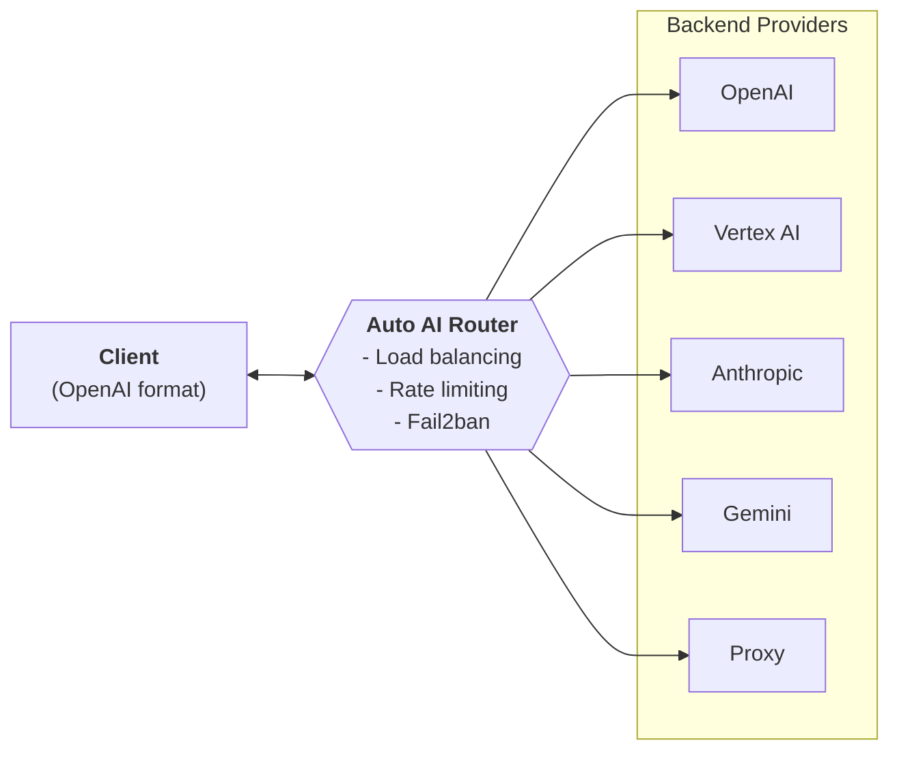

# Auto AI Router

High-performance proxy router for LLM APIs with automatic load balancing, rate limiting, and fail2ban protection.

## Overview

Auto AI Router acts as a unified gateway between your applications and multiple LLM providers. It handles credential rotation, rate limit enforcement, and automatic failover — so your applications only need a single endpoint.

## Features

- **Multi-provider routing** — OpenAI, Vertex AI, Gemini AI Studio, Anthropic
- **Proxy chains** — forward to other Auto AI Router instances as fallback
- **Round-robin balancing** — distribute load across multiple credentials
- **Two-level rate limiting** — per-credential RPM/TPM + per-model limits
- **Fail2ban protection** — auto-ban credentials on repeated errors
- **Prometheus metrics** — request counts, latency, credential utilization
- **Health dashboard** — JSON API and HTML dashboard at `/health` and `/vhealth`
- **LiteLLM DB integration** — spend logging, daily aggregation, API key auth
- **SSE streaming** — full streaming support for all providers
- **Secure config** — environment variable resolution via `os.environ/VAR_NAME`

## Getting Started

1. [Installation](getting-started/installation.md) — build from source or use Docker
2. [Configuration](getting-started/configuration.md) — set up providers and credentials
3. [API Usage](getting-started/api.md) — make your first request
