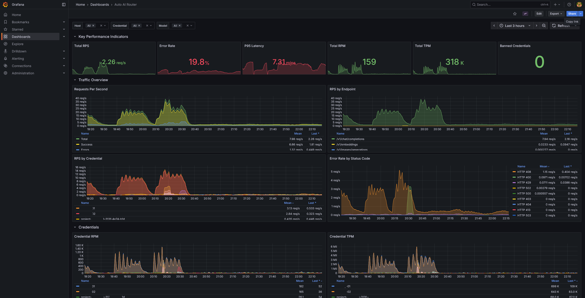

# Grafana Dashboard

A pre-built Grafana dashboard is included in the repository at [`examples/grafana.json`](https://github.com/MiXaiLL76/auto_ai_router/blob/main/examples/grafana.json).

## Import

1. Open Grafana → **Dashboards** → **Import**
2. Click **Upload JSON file** and select `examples/grafana.json`
3. Select your Prometheus data source
4. Click **Import**

## Prerequisites

- Prometheus must be scraping the router (see [Prometheus](prometheus.md))
- Grafana must have the Prometheus data source configured
