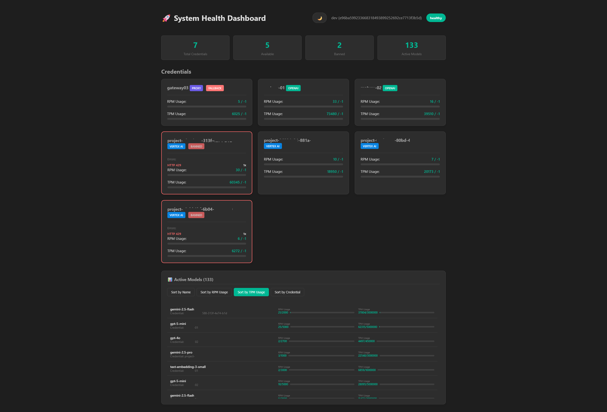

# Health Endpoints

## JSON Health — `/health`

Returns detailed status in JSON format:

```bash
curl http://localhost:8080/health
```

Response includes:

- Status of all credentials (RPM/TPM usage, ban status)
- Status of all configured models
- Aggregated statistics from connected proxy instances

Example:

```bash
curl http://localhost:8080/health | jq '.credentials'
```

## HTML Dashboard — `/vhealth`

An interactive HTML dashboard showing the same information in a visual format:

```
http://localhost:8080/vhealth
```



## Notes

- Health endpoints do not require authentication
- The `/health` path is hardcoded and cannot be reconfigured
- Proxy credential statistics are synced from remote `/health` endpoints every 30 seconds
