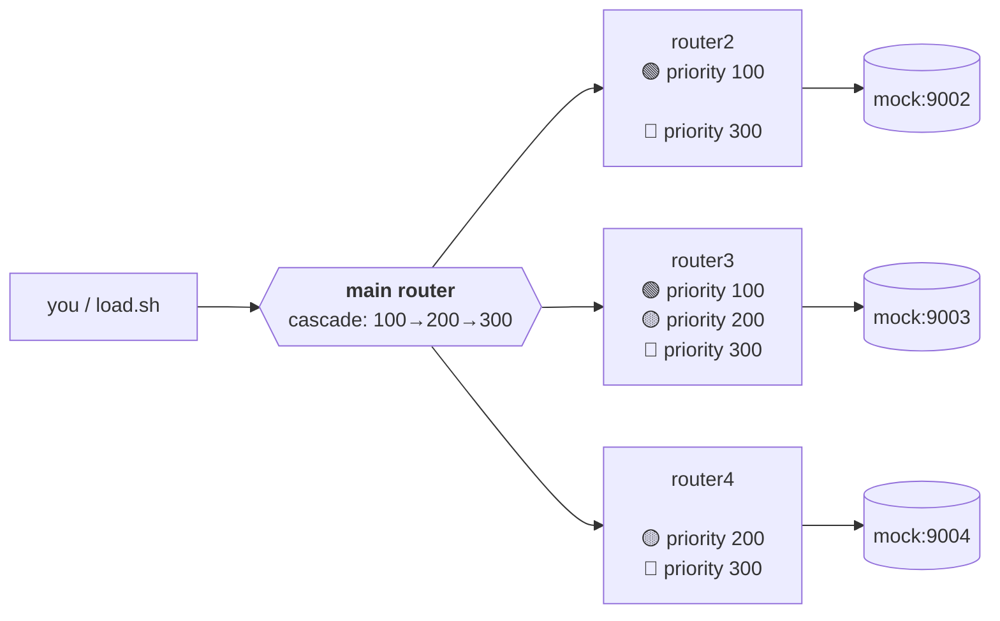

# chain_mock — live priority-cascade demo

A throwaway 5-container playground for watching the priority-group cascade actually move traffic between routers, in real time, on `/vhealth`.

## Topology



`main` doesn't know about mock/model config directly — it discovers models
dynamically from each sub-router's own `/health` (the same AIR sync path a
real ru01→pol01/uk01/ger01 deployment uses). Model-to-router map:

| model   | router2 (100) | router3 (200) | router4 (300) |
| ------- | :-----------: | :-----------: | :-----------: |
| model-a |       ✅      |       ✅       |               |
| model-b |               |       ✅       |       ✅       |
| model-c |       ✅       |       ✅       |       ✅       |

So `model-a` cascades router2→router3, `model-b` cascades router3→router4,
and `model-c` walks the full three-tier chain.

## Why credentials actually get *banned*, not just soft-limited

The mock is genuinely dumb — every request gets a static 200 with
`usage.total_tokens: 10`, nginx does no rate limiting or scripting at all
(see `mock/nginx.conf`). Everything interesting happens in the real router:

1. Each sub-router's mock-credential has `tpm: 200` (20 requests). Once
   `load.sh`'s traffic burns through that, the router's own rate limiter
   refuses to select it and answers `429` — that's the TPM bar you'll watch
   fill up on each sub-router's `/vhealth`.
2. `main` sees that `429` come back from the sub-router (e.g. router2) as a
   retryable error. Its `fail2ban` (`max_attempts: 2`, `ban_duration: 20s`)
   really bans that credential — you'll see a `banned` badge on `main`'s
   dashboard, not just "limit reached".
3. With router2 banned, the priority cascade moves to router3 (200), then
   router4 (300) if that also fills up.

Bans and TPM windows both clear after they expire with no traffic, so a
longer run shows recovery back to the top priority tier too, not just
one-way decay.

## Run it

```sh
# from the repo root — builds/tags ghcr.io/mixaill76/auto_ai_router:latest locally
make docker-build

cd examples/chain_mock
docker compose up -d
./load.sh                    # hammers main across model-a/b/c for ~90s
```

Re-run `make docker-build` after any code change — this compose file never
builds the image itself, it just expects
`ghcr.io/mixaill76/auto_ai_router:latest` to already exist locally.

Then open, in a browser, while `load.sh` is running:

- `http://localhost:8080/vhealth` — **main**: watch the AIR credentials
  (router2/router3/router4) move between "serving now" / "standby" /
  "exhausted" per model, in the "models by priority" cards.
- `http://localhost:8082/vhealth`, `:8083`, `:8084` — each sub-router's own
  view of its single mock credential getting banned and recovering.

`load.sh` also prints a live `model -> HTTP status` line per request in the
terminal, so you can watch the cascade two ways at once.

Env overrides: `MAIN_URL`, `MASTER_KEY`, `DURATION` (seconds, default 90).

## Tear down

```sh
docker compose down
```
