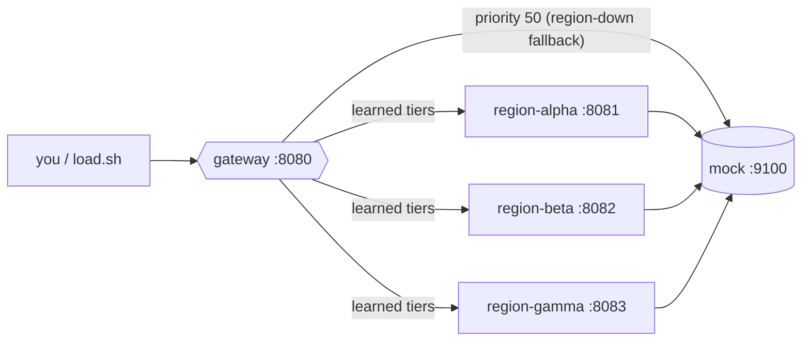

# chain_mock — multi-region AIR chain with per-priority-tier grouping

A throwaway 5-container playground for watching **Design B** (per-priority-tier
grouping of a proxy/AIR credential) actually move traffic, live, on `/vhealth`.

It reproduces the shape of a real `edge -> regional-AIR` fleet: one `gateway`
router fronting three regional routers, each with its own direct leaf
credentials at different `priority` tiers. The gateway never sees the leaf
credentials — it learns each region's per-tier capacity breakdown from that
region's own `/health` and expands the single regional AIR credential into one
balancer candidate per tier.

## Topology



Every leaf credential points at the same deliberately-dumb nginx mock
(`mock/nginx.conf`): static `200`, `usage.total_tokens: 10`, no rate limiting,
no scripting. **All** the interesting behaviour — tier grouping, local
cumulative caps, cascade, `429`, fail2ban bans, recovery — is the real router
reacting to the `rpm`/`tpm` budgets in the `*/config.yaml` files.

## Model → tier map

| model         | region-alpha                            | region-beta                   | region-gamma                           |
| ------------- | --------------------------------------- | ----------------------------- | -------------------------------------- |
| `chat-smart`  | **p1 ×2, p2, p3**, p9 (uncapped)        | **p1**, p9 (uncapped)         | **p1**, p9 (uncapped, `priority: 999`) |
| `chat-fast`   | **p1 ×2 (weighted 2:1), p9 (uncapped)** | **p1**, **p2**                | —                                      |
| `chat-reason` | —                                       | **p1**, **p3**, p9 (uncapped) | p2                                     |
| `embed-v1`    | p1 (unlimited)                          | —                             | —                                      |

Bold = a credential set that spans **more than one** `priority` behind a single
regional router — the case that produces a learned `priority_tiers` array and
candidate expansion at the gateway. Single-tier models (`embed-v1`) stay on the
plain scalar path, unchanged.

Every model under load has an **uncapped tier `p9`** in at least one region, so
the cascade always has somewhere to land and a metered run stays 100% `200`
while you watch the cheaper tiers fill and go on standby. Drop that tier (or
crank `SLEEP` right down) to instead watch regions get fail2banned.

### What the gateway does with `chat-smart`

`region-alpha`'s `/health` reports `chat-smart` served by five credentials at
priorities 1/1/2/3/9. `updateModelLimits` buckets them into four tiers and the
gateway stores that breakdown for the `region-alpha` credential. `region-beta`
and `region-gamma` report a capped `p1` plus an uncapped `p9`. Selection then
cascades through:

```
group 1 : region-alpha@t1 (cum cap 300 tpm)   \
          region-beta@t1  (150 tpm)            }  weighted round-robin
          region-gamma@t1 (120 tpm)           /   (gamma-reserve now tiered at p9, not excluded)
group 2 : region-alpha@t2 (cum cap 420 tpm)
group 3 : region-alpha@t3 (cum cap 500 tpm)
group 9 : region-alpha@t9 / region-beta@t9 / region-gamma@t9   (uncapped backstop)
group 50: house-direct                        (only if a whole region is fail2banned)
```

Under load on `chat-smart`:

1. Group 1 serves. The gateway meters its **own** committed requests to each
   region against that tier's cumulative cap — **no `/health` poll needed**.
   Once `region-alpha`'s tier-1 cap is hit locally it drops out of group 1;
   same for `region-beta@t1` / `region-gamma@t1`.
2. Group 1 empty → cascade to **group 2** (`region-alpha@t2`), then **group 3**,
   then **group 9** (the uncapped backstop), which absorbs the rest.
3. `house-direct` (`priority 50`) is the last resort for when a whole region is
   *fail2banned* (not just tier-capped) — e.g. after you remove the `p9` tiers
   and the regions start returning `429`.
4. Bans (`ban_duration: 20s`) and tpm windows clear with no traffic, so a
   longer run also shows recovery back **up** the tiers.

> The per-tier `current_tpm` / `banned` fields on `/health` come from the last
> upstream poll, so on `/vhealth` the tiers snap between *serving* / *standby*
> on the ~30s poll cadence. The **routing** reacts instantly to the gateway's
> own send rate — that's the whole point of the local cumulative cap.

## Run it

```sh
# from the repo root — builds/tags auto-ai-router:latest locally
make docker-build

cd examples/chain_mock
docker compose up -d
./load.sh                     # ~120s across all four models
```

Re-run `make docker-build` after any code change — this compose file never
builds the image itself.

While `load.sh` runs, open:

- `http://localhost:8080/vhealth` — **gateway**: the "models by priority" cards
  show `region-alpha` appearing in several tiers for `chat-smart`, moving
  between *serving now* / *standby* as each cap fills.
- `http://localhost:8081/vhealth`, `:8082`, `:8083` — each region's own view of
  its leaf credentials burning through their tpm budget and recovering.

`load.sh` prints a live `model -> HTTP status` line per request and a per-model
`ok / non-200` summary at the end.

Knobs (env): `GATEWAY_URL`, `MASTER_KEY`, `DURATION` (s, default 120),
`SLEEP` (s between requests, default 0.15), `MODELS` (space-separated; e.g.
`MODELS="chat-smart" ./load.sh` to drive the cascade on one model fast).

## Inspect the learned tiers directly

```sh
curl -s -H 'Authorization: Bearer sk-gateway' localhost:8080/health \
  | jq '.models["region-alpha:chat-smart"].priority_tiers'

# region-gamma chat-smart p1 limit is 120; gamma-reserve capacity now shows at p9
curl -s -H 'Authorization: Bearer sk-gateway' localhost:8080/health \
  | jq '.models["region-gamma:chat-smart"].limit_tpm'
```

## Tear down

```sh
docker compose down
```

## Notes

- The `tpm` numbers in `*/config.yaml` are tuned so the full cascade is visible
  within one `./load.sh` run — adjust them or `SLEEP` to taste.
- Recursion (a region that itself fronts another AIR router, so tiers fold
  across 3+ hops) is covered by the unit test
  `TestUpdateModelLimits_PriorityTiers_RecursesUpstreamTiers`; to see it here,
  point one region's credential at another router instead of the mock.
